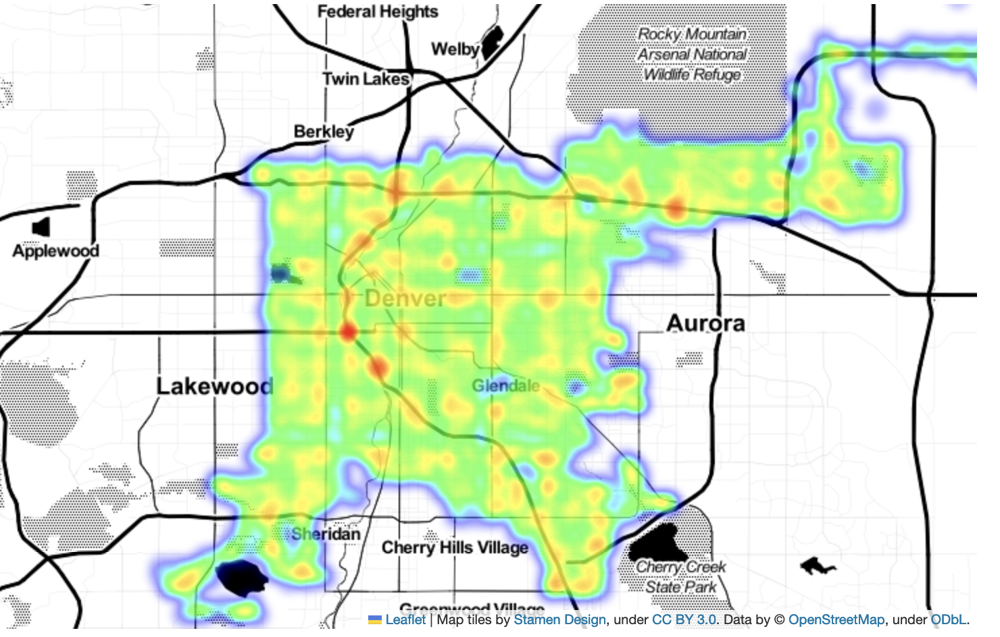
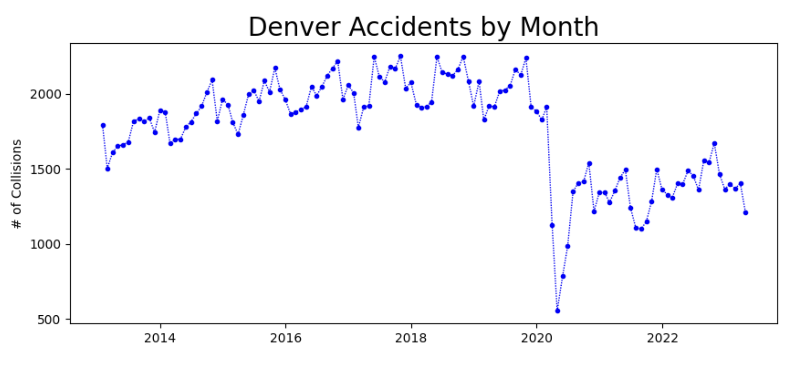
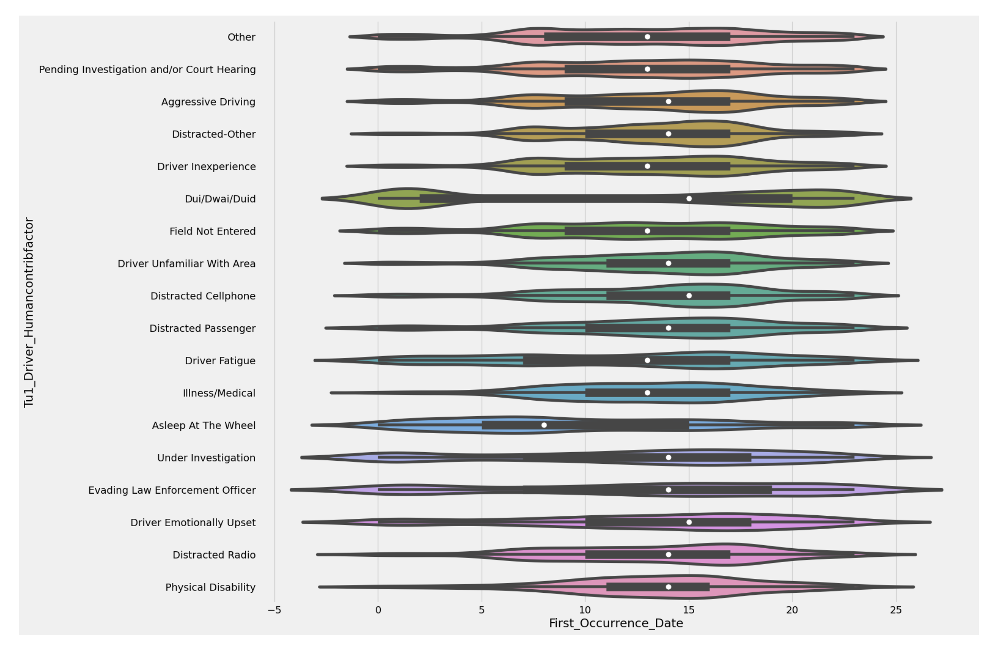
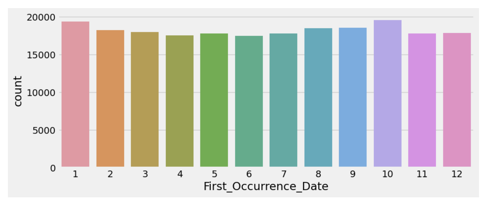

# DenverDriving
Project Description: This is an end-to-end project. It gets data from [City of Denver Open Data Catalog](http://data.denvergov.org) does some processing of the data, and uploads the data to Kaggle as the [Denver Traffic Accidents dataset](https://www.kaggle.com/datasets/hrokrin/denver-traffic-accidents).

Note: I'm expanding the project but haven't finalized how updating will work. I may go with a GitHub Action but might additionally layer in Airflow and Docker. The display is also up in the air. I'll leave Jupyter notebooks as an option but, depending on hosting options, I think Panel looks attractive. Unfortunately, the long pole in the tent to automate this I need to figure out dynamic web pages if I want to get around the 2000 record limit of ESRI's database, which Denver has recently gone to for serving data.
   

## Table of Contents
- [Project Description](#project-description)
- [Discussion](#discussion)
- [Takeaways from the Sample EDA Notebook ](#takeaways-from-the-sample-eda-notebook)
- [Project Status](#project-status)
   

Project layout: 
 -  `src` folder 
    - `callreq.py` - downloads csv of all data with requests
    - `pipeline.py` - transfrorms data
 - `notebooks` folder with:
   - `Denver_Traffic_Accidents_All_In_One` 
   - `Denver_Traffic_Accidents_Data_Display` notebooks
 - `images` folder with images for both Kaggle and GitHub
 - `tests` folder   
   
[Top ](#table-of-contents)
   

## Discussion
[According to the CDC](https://www.cdc.gov/transportationsafety/pdf/statecosts/2020/CDC-Cost-of-Crash-Deaths-Fact-Sheets_Colorado.pdf), traffic accidents cost Colorado 943M$ in 2018 alone and that number doesn't seem to include the property loss. In 2022 an article in [Denverite](https://denverite.com/2022/01/14/so-how-many-traffic-accidents-occured-on-denvers-neighborhood-streets-in-2021-this-many/) noted there were just over 3100 wrecks on streets with a speed limit of 25 mph. Of those 3100+ accidents, 84 resulted in a fatality. As a result, the city approved the "20 is plenty" ordinance, cutting the speed limit to 20mph. Both of these articles are good and might be a start on additional visualizations.

[Top ](#table-of-contents)
  

## Takeaways from the Sample EDA Notebook 
Kaggle wants an EDA notebook included with submissions for the dataset to get a perfect rating. I find this annoying as what gets passed off as EDA is often just the output of a generic, minimal script (head(), shape(), describe(), etc). I try to put more thought into it but I don't live in Denver and haven't been there since I was there for a data science program. So I don't have much at stake but I also don't have any local knowledge that could be the basis of deeper insights. I went with questions I wanted the answers to but more as a way of displaying data rather than telling a story with data.  

Still, there are a few takeaways.

1. While there are some common accident sites (shown here with a heatmap) the entire city is fair game.

 

2. Covid had a major positive impact on accidents.

 

3. Ruling out non-causes such as "No Apparent", "Other" and "Pending Investigation and/or Court Hearing" we can see aggressive and distracted driving are major issues. Notably, cell phones are smaller than what one might expect.

 

4. DUI/DWAI/DUID-related accidents match our intuition of happening more in the evening hours

 

 5. There is a slight degree of seasonality. This is also seen in the monthly chart above, which aggregates the 10 years.

[Top ](#table-of-contents)
  

## Project status
1. Kaggle: Dataset and accompanying notebook uploaded with infrequent updates
2. Acquiring update infomation: 😖
3. GitHub: Expanding and refactoring

[Top ](#table-of-contents)
